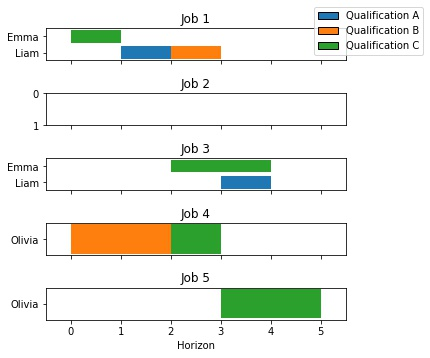

# SDP_Optimization

# Results

| Instance | Profit | Assignation Moyenne  | Durée Max  | Runtime | Profit max  |
|:--------:|:------:|:--------------------:|:----------:|:-------:|:-----------:|
|    Toy   |   65   |          2.0         |      3     |    3s   |      80     |
|  Medium  |   413  |          4.4         |     12     |   1h17  |     510     |
|   Large  |        |                      |            |         |             |

## Toy Instance

Planning for toy instance with optimal solution:

Pareto for toy instance:

| Points                                            | Surface                                            | Tri Surface                                            |
|----------------------------------------------------|----------------------------------------------------|--------------------------------------------------------|
| | | ||

## Medium Instance
Planning for medium instance with optimal solution:

## Pierre-Alexandre Klein, Juliette Léorat, Daniel Lévy 